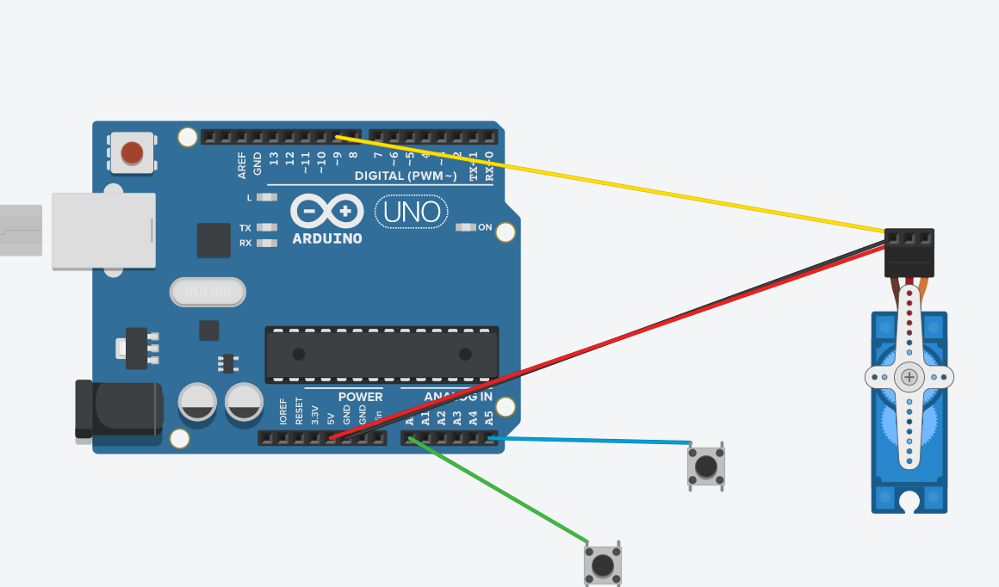

# CircuitPython
 The follwing files are my first foray into CircuitPython.
## Table of Contents
* [Table of Contents](#TableOfContents)
* [Hello_CircuitPython](#Hello_CircuitPython)
* [CircuitPython_Servo](#CircuitPython_Servo)
* [CircuitPython_LCD](#CircuitPython_LCD)
* [NextAssignmentGoesHere](#NextAssignment)
---

## Hello_CircuitPython

### Description & Code

This is how you make the light turn different colors, each set of 3 numbers is a different color and time.sleep is how long the colors stay there.

```python

while True:
    dot.fill((255,0,0))
    time.sleep(0.5)
    dot.fill((255,255,0))
    time.sleep(0.5)
    dot.fill((0,255,0))
    time.sleep(0.5)
    dot.fill((0,255,255))
    time.sleep(0.5)
    dot.fill((0,0,255))
    time.sleep(0.5)
    dot.fill((255,0,255))
    time.sleep(0.5)

```


### Evidence
Pictures / Gifs of your work should go here

### Images
Make an account with your google ID at [tinkercad.com](https://www.tinkercad.com/learn/circuits), and use "TinkerCad Circuits to make a wiring diagram."  It's really easy!  
Then post an image here.   [here's a quick tutorial for all markdown code, like making links](https://www.markdownguide.org/basic-syntax/)

### Reflection
What went wrong / was challenging, how'd you figure it out, and what did you learn from that experience?  Your ultimate goal for the reflection is to pass on knowledge that will make this assignment better or easier for the next person.
Nothing went wrong


## CircuitPython_Servo

### Description & Code
This is the meat of the code, it makes each wire a button and tells it which analog pin it is going into, it then prints "Touched the () wire" when that wire is touched.it then turns the servo one way or another which it -/+ 5

```python

touch_pad1 = board.A0  
touch1 = touchio.TouchIn(touch_pad1)
touch_pad2 = board.A5  
touch2 = touchio.TouchIn(touch_pad2)

while True:

    if touch1.value:
        print("Touched the White Wire!")
        for angle in range(0, 180, 5):  # 0 - 180 degrees, 5 degrees at a time.
            my_servo.angle = angle
            time.sleep(0.05)
    if touch2.value:
        print("Touched the Green Wire!")
        for angle in range(180, 0, -5):  # 180 - 0 degrees, 5 degrees at a time
            my_servo.angle = angle
            time.sleep(0.05)
    time.sleep(0.05)
    print("end of loop!")

```

### Wiring



### Evidence


### Reflection
This assingment taught me a lot about how to use circuit python, I learned how to use touch values and how to use the servo with circuit python


## CircuitPython_LCD

### Description & Code

```python
Code goes here

```

### Evidence

### Images

### Reflection


## CircuitPython_DistanceSensor

### Description & Code

```python
Code goes here

```

### Evidence


### Images

### Reflection
 
