# CircuitPython
 The follwing files are my first foray into CircuitPython.
## Table of Contents
* [Hello_CircuitPython](#Hello_CircuitPython)
* [CircuitPython_Servo](#CircuitPython_Servo)
* [CircuitPython_Distance Sesnor](#CircuitPython_DistanceSensor)
* [Circuit Python Photo interuptor](#CircuitPython_Photo_Interuptor)
---

## Hello_CircuitPython

### Description & Code

This assingment was to change the led of the metro board to different colors using dot.fill.

```python

while True:
    dot.fill((255,0,0))
    time.sleep(0.5)
    dot.fill((255,255,0))
    time.sleep(0.5)
    dot.fill((0,255,0))
    time.sleep(0.5)
    dot.fill((0,255,255))
    time.sleep(0.5)
    dot.fill((0,0,255))
    time.sleep(0.5)
    dot.fill((255,0,255))
    time.sleep(0.5)

```
The dot.fill code is what changes the color of the board, the values after are the specific color, and the time.sleep is the time inbetween the changing colors.

### Evidence

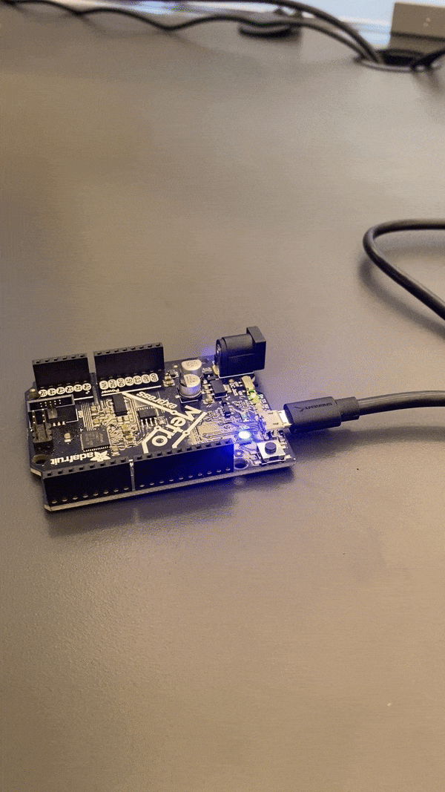
This image shows the led in the board changing colors.

[Credit to Quinn Ragsdale](https://github.com/qragsda80/CircuitPython1#evidence)

### Wiring

No Wiring for this assingment as it was just the board.

### Reflection

The hard part about this assingment was figuring out the different RGB values of the colors. I was able to find the values  on this  
[Website](https://www.w3schools.com/colors/colors_picker.asp)
This website gives all of the values you need for every specific color.

## CircuitPython_Servo

### Description & Code

This assingment was to use capacitive touch to change the direction of a turning servo.

```python

touch_pad1 = board.A0  
touch1 = touchio.TouchIn(touch_pad1)
touch_pad2 = board.A5  
touch2 = touchio.TouchIn(touch_pad2)

while True:

    if touch1.value:
        print("Touched the White Wire!")
        for angle in range(0, 180, 5):  # 0 - 180 degrees, 5 degrees at a time.
            my_servo.angle = angle
            time.sleep(0.05)
    if touch2.value:
        print("Touched the Green Wire!")
        for angle in range(180, 0, -5):  # 180 - 0 degrees, 5 degrees at a time
            my_servo.angle = angle
            time.sleep(0.05)
    time.sleep(0.05)
    print("end of loop!")

```
This is the meat of the code, it makes each wire a button and tells it which analog pin it is going into, it then prints "Touched the () wire" when that wire is touched.it then turns the servo one way or another which it -/+ 5

### Wiring

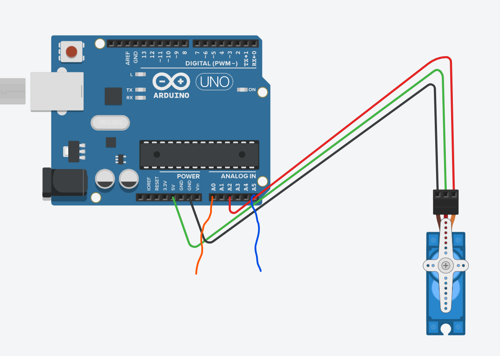

[Credit to Quinn Ragsdale](https://github.com/qragsda80/CircuitPython1#evidence)

The two loose wires in this code stemming from A0 and A5 represent the two wires used for capacitive touch, there is also only 3 wires going to the servo in this wiring diagram but the servos we use require 4.

### Evidence


This GIF shows the servo turning different directions when a different wire is toucheed. In this video it is a little confusing because I accedintaly touch two wires at once causing it to turn around prematurely.

### Reflection

The part  of this assingment that I struggled with was figuring out how to use capacitive touch. The key to capacitive touch is the touch1.value and using the library touchio. Once you have touch value set up you just have to set the angle range and direction using "for angle in range(0, 180, 5)" Switch 5 to -5 to turn other way


## CircuitPython_DistanceSensor

### Description & Code

This assingment was to code a distance sensor to change the colors of the led on the Metro board based off of how far away an object is.

```python
  if distance < 5:
            print("red")
            dot.fill((255, 0, 0))
        elif distance <= 20:
            r = 255-((distance-5)/15*255)
            g = 0
            b = (distance-5)/15*255
            dot.fill((int(r), int(g), int(b)))
        else:
            # Had two else statements which isn't allowed,
            # had unnecesary funciton which conjumbled code
            # didnt have necesary library for mapped function
            r = 0
            g = simpleio.map_range(distance, 20, 35, 0, 255)  #had two things saying the same thins which made my code a mess
            b = simpleio.map_range(distance, 20, 35, 255, 0)
            dot.fill((int(r), int(g), int(b)))

```

This is the main two parts of the distance sensor code. The first part is using a function to have light on board fade and change colors. Since the math would be confusing if I used a function going from 20-35, the better option was to use a map. That is the second part of the code mapping blue to green.

### Evidence


This Gif shows a breadboard as the object going father away and closer from the distance sesnor, and the distance sesnor changing the colors of the led on the board as a result of that.

### Wiring


This wiring is innacurate because the ditance sensor in this diagram only has 3 connecting wires, whereas the distance sesnor I used has 4 wires.


### Reflection
 
I struggled with making the map function. I learned that you need to you have to create a map_range useing simpleio. You then have to set your values to map Ex: (distance, 20, 35, 0, 255). At first I did'nt have the simpleio library which is why it wasn't working. Here is link to  
[library](https://github.com/adafruit/Adafruit_CircuitPython_SimpleIO)
 
 ## CircuitPython_Photo_Interuptor
 
 ### Description & Code
This assingment was to use a photointeruptor to count the amount of times an object passed through the photointeruprto and print that to serial monitor.

```python
max = 4
start = time.monotonic()
while True:
    photo = interrupter.value
    if photo and not state:
            counter += 1
    state = photo

    remaining = max - time.monotonic()

    if remaining <= 0:
        print("Interrupts:", str(counter))
        max = time.monotonic() + 4
        counter = 0

```

This is all of the code that uses time.monotonic() to start the photointerruptor, and use a counter to add 1 every time an object passes through it.

[Link to code I used, Credit to Gventre04](https://github.com/gventre04/CircuitPython#photo-interrupter)

### Evidence


This video shows an object passing through the photo interruptor, adding one to the serial monitor every time it does that.

### Wiring
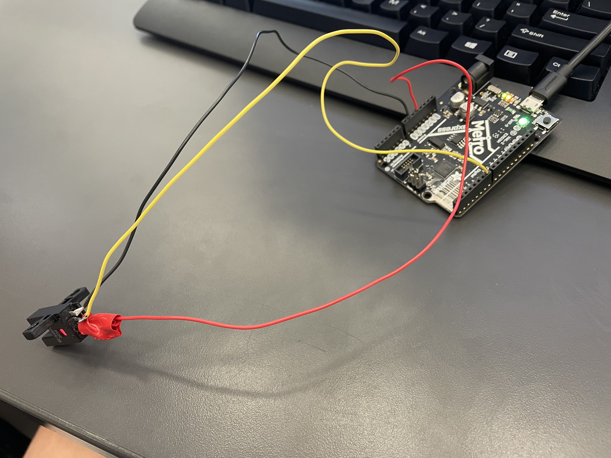

This is an actual picture of the wiring I used. The electric tape is to prevent the two prongs of the photointerruptor from touching eachother.

### Reflection
 
 I could not figure out why the [Gventre04](https://github.com/gventre04/CircuitPython#photo-interrupter) code was not working. The problem is they used time.time whic does not work with the most updtaed version of Mu. Instead you have to use time.monotonic for the code to work.

 ## 2.1-2.5 Skateboard

### Description
 This was the first part of the skateboard design and it was very easy to complete

### Evidence

Deck 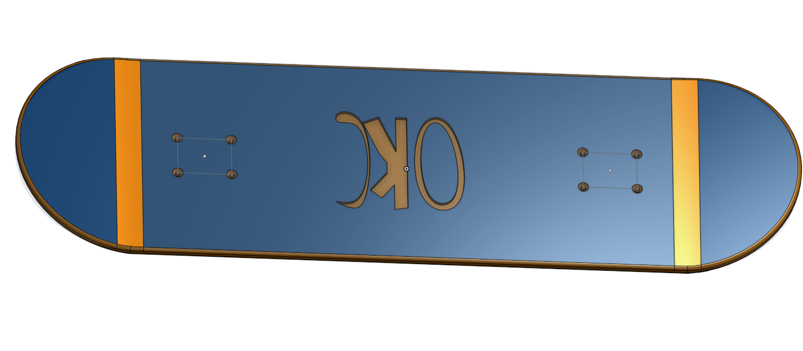

Trucks  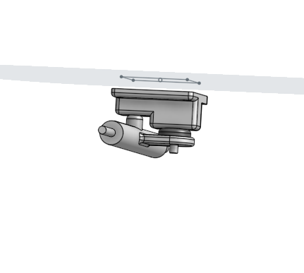

Wheels and bearings 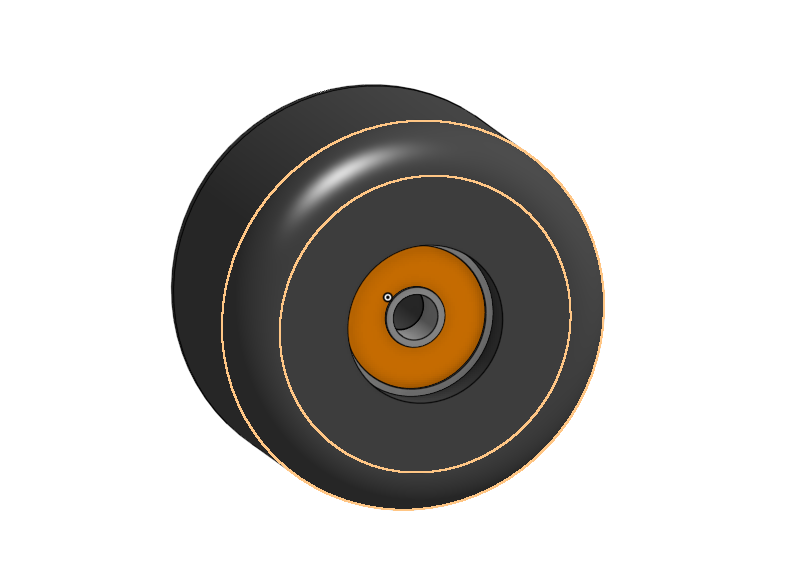

Assembly 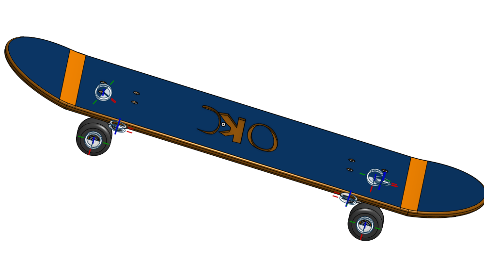

Let It shred (Bend the Board and inscribe Logo)  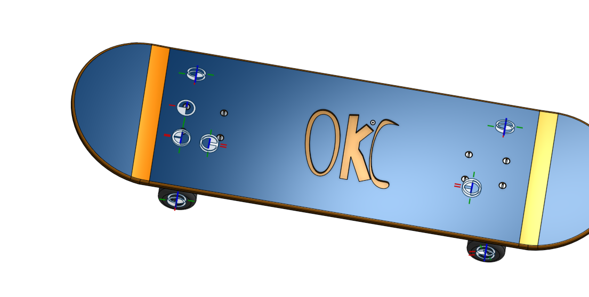
 
### Reflection
The part I struggled the most on when designing the skateboard was the wheels and bearings. When I would deimensions the starting shape to be revolved it would go below the centerline you draw first. This messes up the revolve so to fix this make sure your whole shape is above the centerline before revolving.

Another thing that wasn't neccesary that I did was insert each nut and bolt into assembly indivudaly, when you could just make a pattern to do them all at once.
 
 ## 3.1 How the pros do it.
 

### Description
This assingment was to build a 2x4 lego brick using variables so you are able to make configurations later on.

### Evidence
 
 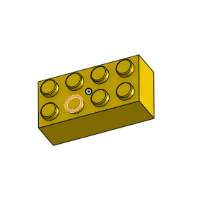
 This image shows the 2x4 brick.
 
 ### Reflection
 
 I struggled with the linear pattern because I wasnt selected the right edge to pattern it along. You have to select the edge of the brick parallel to the pattern you want to make.
 
 ## 3.2 One brick to rule them all
 

### Description
 
 The assingment was to build a brick that could change using configurations to make the simple brick changlable into different shapes, rows/coloumns, and colors.

### Evidence
 
 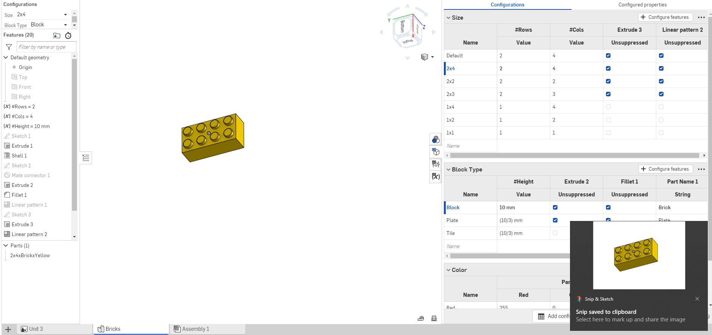
 
 This image shows the configurations and the brick that is changed by those configurations
 
 ### Reflection
 
 I struggled with this assingment because when I would do a brick with 1 column, the bottom connector piece would stick out in a wierd way. You can fix this by deleting the linear pattern for the configurations with 1 coloumn.
 
 
  ## 3.3 Putting it all toghether.
 

### Description
This assingment was to put some of the bricks together to make a lego duck using the snap tool.

### Evidence
 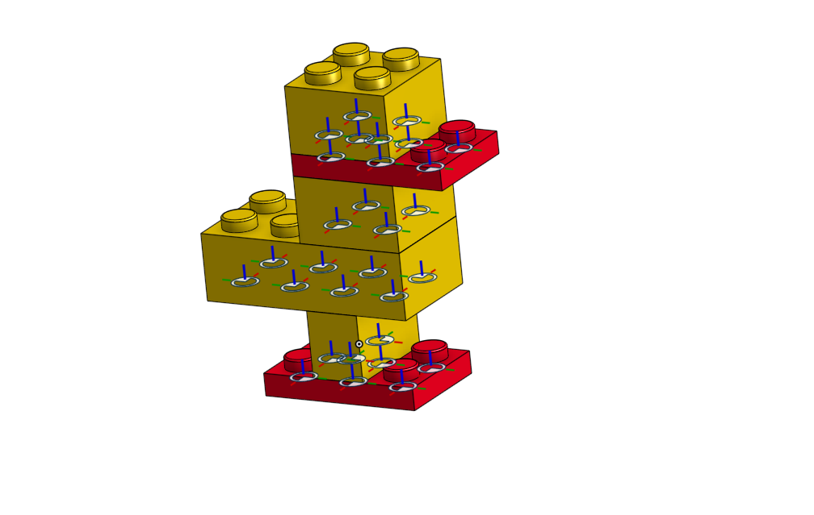
 
 This image shows the constructed duck along with the mate. connectors
 
 ### Reflection
 
 When using the snap tool only some of the mate connectors would show, so I couldn't make the neccesary connections. To fix this I had to go back to the original skethc of the brick and turn on all of the mate connectors.
 
## 3.4 Drawing
 

### Description
This assingment was to make a detailed drawing of the duck assembly.

### Evidence
 
 This shows the completed drawing of the duck
 
 ### Reflection
 
 I didn't know how to explode the duck at first, the problem was I wasn't seperating them apart correctly, I was connecting them when seperating them, You have to drag each piece apart sepereately.

